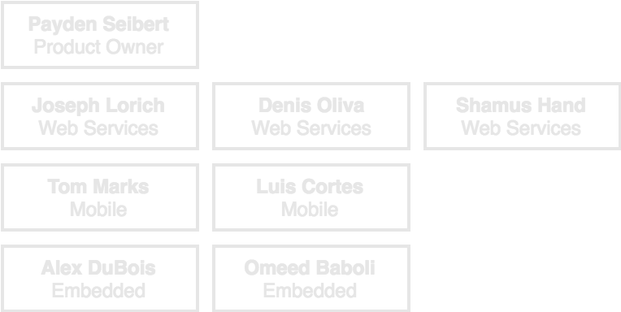
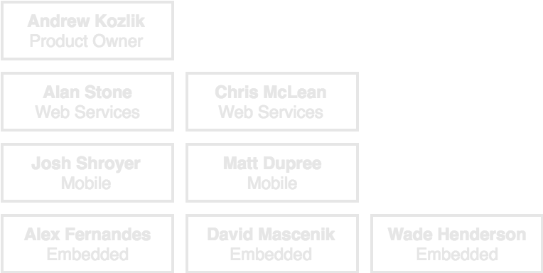
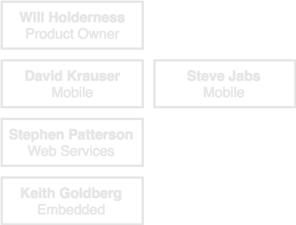
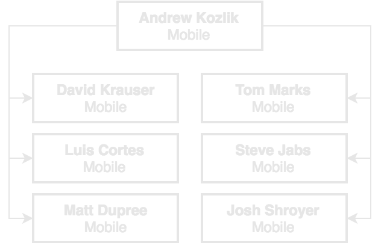
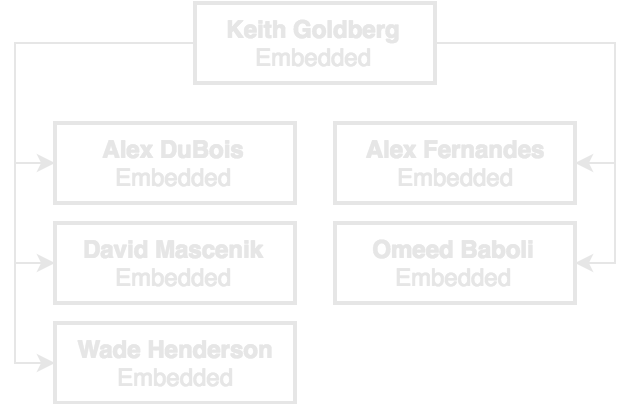
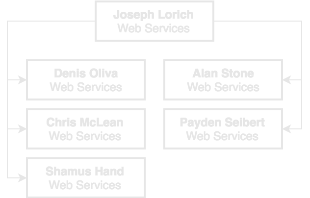
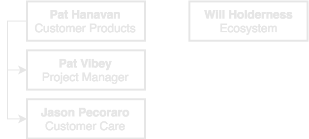

## Opportunity

Let's discover what changes we could make to improve productivity, quality, and morale at UniKey

## Goals

 - Increase communication and aligment
 - Encourage collaboration
 - Improve productivity
 - Promote technical excellence
 - Support the Product and Ecosystem teams more effectively
 - Promote a sense of ownership and autonomy

## The Idea

If organize around the way we work naturally we can find greater efficiency as teams and break down walls between people who need to be working together closely.

## So how do we work naturally
- Let's look at times requiring extreme productivity or coordination across multiple teams
  - Kevo Plus launch
  - Nortek inital demo
  - UniKeg
  - Lock History
  - Grosvenor 12/1 delivery

In each of these situations we wound up with people from multiple disciplines working (and even sitting) closely together, sharing ideas, and talking frequently.  Coordination happened almost effortlessly and we were able to move and pivot at a much faster pace than normal.  We felt a sense of ownership over what we were delivering, and a sense of pride when we shipped.

So how can we organize around this natural structure while maintaining technical excellence and giving support to the product and ecosystem teams, bridging the gap between short term flexibility and longer term feature plans and product/ecosystem roadmaps?

- Discipline based reporting structure
- Cross-functional feature teams grouped by product
- Dedicated person on each team  to bridge the gap between Product/Ecosystem and Engineering (filling the typical scrum "Product Owner" role.  Not necessarily responsible for defining the product, but responsible for making sure the definition is there for the team)

## So what might it look like?
We'll follow the Spotify nomenclature here since they have a lot of well-documented literature on the subject.

Please note we have left Test, Sales, Hardware, Infrastructure, Marketing and QA off of this proposal for the time being as they often work much more indepedently.  We would like to encourage their involvment in these ideas as well, but for now this provides a good starting point.

## Squads
A squad is a cross-functional team with a dedicated product owner working together towards a common goal.  There is no reporting structure within a squad, just different roles.

#### Commercial Squad

#### Residential Squad

#### Ecosystem Squad

## Chapters
A chapter is a group of people in a single discipline, reporting to a Chapter Lead.  The goal of a chapter is to promote excellence with the discipline while providing a more traditional reporting structure for HR, growth, and company needs.

#### Mobile Chapter

#### Embedded Chapter

#### Web Services Chapter

#### Product Chapter / Ecosystem Chapter

## Notes

- Product and Ecosystem still focus on user experience, long term planning, and quality
- Product Owners work with Product and Ecosystem to create stories based on given requirements
- Chapter Leads work with Architecture Team to encourage technical excellence 
- Each team may elect a Scrum Master to help remove imediments, facilitate meetings, drive processes, etc.

## Possible Modifications

- Product owners could report through a Product Chapter

## Positive Thoughts

- People can move between squads without changing reporting structure
- A dedicated team is now responsible from definition to delivery of a feature
- No need for organizing collaboration and communication since it happens automatically

## Potential Pitfalls

- Chapters working less closely, potentially more difficult to maintain technical excellence
- Multiple feature teams working on the same individual deliverable (e.g. ecosystem changes to part of the residential API) may require some added release management/organization

#### The End